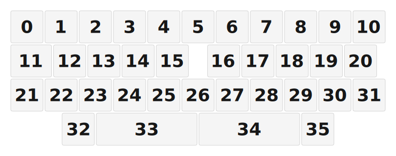

# ZMK Configuration for John Treadvaulta

*Generated by Shield Wizard for ZMK*



Download compiled firmware from the Actions tab. <https://zmk.dev/docs/user-setup#installing-the-firmware>

Edit your keymap <https://zmk.dev/docs/keymaps>.
User keymap is located at [`config/john_treadvaulta.keymap`](config/john_treadvaulta.keymap).

-----

<details>
<summary>
Shield Wizard Debug Information
</summary>

In case of broken configuration, here is the Shield Wizard internal data used to generate this configuration:

Commit: 63ab9b7bd8845252979f45da72f40210b0b1a3ae

```json
{"name":"John Treadvaulta","shield":"john_treadvaulta","dongle":false,"modules":[],"layout":[{"id":"01KVQZWE24AG36XE3V4PCEWYYX","part":0,"row":0,"col":0,"w":1,"h":1,"x":0,"y":0,"r":0,"rx":0,"ry":0},{"id":"01KVQZWJA0Q95CRD7D8P069G45","part":0,"row":0,"col":1,"w":1,"h":1,"x":1,"y":0,"r":0,"rx":0,"ry":0},{"id":"01KVQZWJQCZC52X84QQ1WS55W1","part":0,"row":0,"col":2,"w":1,"h":1,"x":2,"y":0,"r":0,"rx":0,"ry":0},{"id":"01KVQZWK83NGKGGH54HWDZ1P7F","part":0,"row":0,"col":3,"w":1,"h":1,"x":3,"y":0,"r":0,"rx":0,"ry":0},{"id":"01KVQZWKSKNJK7Z2BANNSS89BH","part":0,"row":0,"col":4,"w":1,"h":1,"x":4,"y":0,"r":0,"rx":0,"ry":0},{"id":"01KVQZWM3F0B837W0HC0ZSHD4E","part":0,"row":0,"col":5,"w":1,"h":1,"x":5,"y":0,"r":0,"rx":0,"ry":0},{"id":"01KVQZWMB821BMPEQKY5P1W7ZC","part":0,"row":0,"col":6,"w":1,"h":1,"x":6,"y":0,"r":0,"rx":0,"ry":0},{"id":"01KVQZWMHSR6Y4JFJ73SEN5S4E","part":0,"row":0,"col":7,"w":1,"h":1,"x":7,"y":0,"r":0,"rx":0,"ry":0},{"id":"01KVQZWMRZ0231AF34HXNMS0JT","part":0,"row":0,"col":8,"w":1,"h":1,"x":8,"y":0,"r":0,"rx":0,"ry":0},{"id":"01KVQZWN31AG6MNDQRBSNP4EH8","part":0,"row":0,"col":9,"w":1,"h":1,"x":9,"y":0,"r":0,"rx":0,"ry":0},{"id":"01KVQZWNG3CRA9G18M1K92KAZE","part":0,"row":0,"col":10,"w":1,"h":1,"x":10,"y":0,"r":0,"rx":0,"ry":0},{"id":"01KVQZWSQGFA02C3CRPG8FP66R","part":0,"row":1,"col":0,"w":1.25,"h":1,"x":0,"y":1,"r":0,"rx":0,"ry":0},{"id":"01KVQZXFSXDZEZMJXE6TT3HD3Q","part":0,"row":1,"col":1,"w":1,"h":1,"x":1.25,"y":1,"r":0,"rx":0,"ry":0},{"id":"01KVQZXG86NQVS0V9AVACA4Z9D","part":0,"row":1,"col":2,"w":1,"h":1,"x":2.25,"y":1,"r":0,"rx":0,"ry":0},{"id":"01KVQZXGFTTXWRJ72PJB9VV1WB","part":0,"row":1,"col":3,"w":1,"h":1,"x":3.25,"y":1,"r":0,"rx":0,"ry":0},{"id":"01KVQZXGPYYYHQGVV2ZSSK89BB","part":0,"row":1,"col":4,"w":1,"h":1,"x":4.25,"y":1,"r":0,"rx":0,"ry":0},{"id":"01KVQZXGYP1PH3CJ3ADTJVCEWX","part":0,"row":1,"col":6,"w":1,"h":1,"x":5.75,"y":1,"r":0,"rx":0,"ry":0},{"id":"01KVQZXH9EYXEG2PJQX5ZJEGTT","part":0,"row":1,"col":7,"w":1,"h":1,"x":6.75,"y":1,"r":0,"rx":0,"ry":0},{"id":"01KVQZXHN9NMP1KT722J7C4R38","part":0,"row":1,"col":8,"w":1,"h":1,"x":7.75,"y":1,"r":0,"rx":0,"ry":0},{"id":"01KVQZXHYTFRQZ9VX6MSNTT7HS","part":0,"row":1,"col":9,"w":1,"h":1,"x":8.75,"y":1,"r":0,"rx":0,"ry":0},{"id":"01KVQZXJET7QA5ZSWYYGNNTBPZ","part":0,"row":1,"col":10,"w":1,"h":1,"x":9.75,"y":1,"r":0,"rx":0,"ry":0},{"id":"01KVR01H1TG369JG87W365V60J","part":0,"row":2,"col":0,"w":1,"h":1,"x":0,"y":2,"r":0,"rx":0,"ry":0},{"id":"01KVR029YMGC9RBAAWB4YEBDY4","part":0,"row":2,"col":1,"w":1,"h":1,"x":1,"y":2,"r":0,"rx":0,"ry":0},{"id":"01KVR02E0QPXK41S3K6N76QWMW","part":0,"row":2,"col":2,"w":1,"h":1,"x":2,"y":2,"r":0,"rx":0,"ry":0},{"id":"01KVR02EZEE3FN0SBHA7GTBYFS","part":0,"row":2,"col":3,"w":1,"h":1,"x":3,"y":2,"r":0,"rx":0,"ry":0},{"id":"01KVR02FX0M7FGACZ1X7114BZ1","part":0,"row":2,"col":4,"w":1,"h":1,"x":4,"y":2,"r":0,"rx":0,"ry":0},{"id":"01KVR02G3FJDHFCQBRJ8XC3AWK","part":0,"row":2,"col":5,"w":1,"h":1,"x":5,"y":2,"r":0,"rx":0,"ry":0},{"id":"01KVR02G9T94J8KC1EG2DPVRHW","part":0,"row":2,"col":6,"w":1,"h":1,"x":6,"y":2,"r":0,"rx":0,"ry":0},{"id":"01KVR02GG9CMW2TXE5M8WDTWAZ","part":0,"row":2,"col":7,"w":1,"h":1,"x":7,"y":2,"r":0,"rx":0,"ry":0},{"id":"01KVR02GP7056A9TCD3BY98G09","part":0,"row":2,"col":8,"w":1,"h":1,"x":8,"y":2,"r":0,"rx":0,"ry":0},{"id":"01KVR02GYVNGSR1442CWKXMZSK","part":0,"row":2,"col":9,"w":1,"h":1,"x":9,"y":2,"r":0,"rx":0,"ry":0},{"id":"01KVR02H9MR860G3NHSNYDXYNV","part":0,"row":2,"col":10,"w":1,"h":1,"x":10,"y":2,"r":0,"rx":0,"ry":0},{"id":"01KVR0337YE8DXGA6HMKM3HZFS","part":0,"row":3,"col":2,"w":1,"h":1,"x":1.5,"y":3,"r":0,"rx":0,"ry":0},{"id":"01KVR051M8TCNM7R0PZ6SSJ7PZ","part":0,"row":3,"col":4,"w":3,"h":1,"x":2.5,"y":3,"r":0,"rx":0,"ry":0},{"id":"01KVR060FYFWJ5MVZP4NZQGRKH","part":0,"row":3,"col":6,"w":3,"h":1,"x":5.5,"y":3,"r":0,"rx":0,"ry":0},{"id":"01KVR06MCN9CK96JR4VQE7WP3R","part":0,"row":3,"col":8,"w":1,"h":1,"x":8.5,"y":3,"r":0,"rx":0,"ry":0}],"parts":[{"name":"unibody","controller":"kb2040","wiring":"matrix_diode","pins":{"d10":"input","d0":"input","d1":"input","d2":"input","d3":"output","d4":"output","d5":"output","d6":"output","d7":"output","d8":"output","gp12":"output","gp13":"output","d14":"output","d15":"output","d16":"output"},"keys":{"01KVQZWE24AG36XE3V4PCEWYYX":{"input":"d10","output":"d3"},"01KVQZWJA0Q95CRD7D8P069G45":{"input":"d10","output":"d4"},"01KVQZWJQCZC52X84QQ1WS55W1":{"input":"d10","output":"d5"},"01KVQZWK83NGKGGH54HWDZ1P7F":{"input":"d10","output":"d6"},"01KVQZWKSKNJK7Z2BANNSS89BH":{"input":"d10","output":"d7"},"01KVQZWM3F0B837W0HC0ZSHD4E":{"input":"d10","output":"d8"},"01KVQZWMB821BMPEQKY5P1W7ZC":{"input":"d10","output":"gp12"},"01KVQZWMHSR6Y4JFJ73SEN5S4E":{"input":"d10","output":"gp13"},"01KVQZWMRZ0231AF34HXNMS0JT":{"input":"d10","output":"d14"},"01KVQZWN31AG6MNDQRBSNP4EH8":{"input":"d10","output":"d15"},"01KVQZWNG3CRA9G18M1K92KAZE":{"input":"d10","output":"d16"},"01KVQZWSQGFA02C3CRPG8FP66R":{"input":"d0","output":"d3"},"01KVQZXFSXDZEZMJXE6TT3HD3Q":{"input":"d0","output":"d4"},"01KVQZXG86NQVS0V9AVACA4Z9D":{"input":"d0","output":"d5"},"01KVQZXGFTTXWRJ72PJB9VV1WB":{"input":"d0","output":"d6"},"01KVQZXGPYYYHQGVV2ZSSK89BB":{"input":"d0","output":"d7"},"01KVQZXH9EYXEG2PJQX5ZJEGTT":{"input":"d0","output":"gp13"},"01KVQZXGYP1PH3CJ3ADTJVCEWX":{"input":"d0","output":"gp12"},"01KVQZXHN9NMP1KT722J7C4R38":{"input":"d0","output":"d14"},"01KVQZXHYTFRQZ9VX6MSNTT7HS":{"input":"d0","output":"d15"},"01KVQZXJET7QA5ZSWYYGNNTBPZ":{"input":"d0","output":"d16"},"01KVR01H1TG369JG87W365V60J":{"input":"d1","output":"d3"},"01KVR029YMGC9RBAAWB4YEBDY4":{"input":"d1","output":"d4"},"01KVR02E0QPXK41S3K6N76QWMW":{"input":"d1","output":"d5"},"01KVR02EZEE3FN0SBHA7GTBYFS":{"input":"d1","output":"d6"},"01KVR02FX0M7FGACZ1X7114BZ1":{"input":"d1","output":"d7"},"01KVR02G3FJDHFCQBRJ8XC3AWK":{"input":"d1","output":"d8"},"01KVR02G9T94J8KC1EG2DPVRHW":{"input":"d1","output":"gp12"},"01KVR02GG9CMW2TXE5M8WDTWAZ":{"input":"d1","output":"gp13"},"01KVR02GP7056A9TCD3BY98G09":{"input":"d1","output":"d14"},"01KVR02GYVNGSR1442CWKXMZSK":{"input":"d1","output":"d15"},"01KVR02H9MR860G3NHSNYDXYNV":{"input":"d1","output":"d16"},"01KVR0337YE8DXGA6HMKM3HZFS":{"input":"d2","output":"d5"},"01KVR051M8TCNM7R0PZ6SSJ7PZ":{"input":"d2","output":"d7"},"01KVR060FYFWJ5MVZP4NZQGRKH":{"input":"d2","output":"gp12"},"01KVR06MCN9CK96JR4VQE7WP3R":{"input":"d2","output":"d14"}},"encoders":[],"buses":[{"name":"spi0","devices":[],"type":"spi"},{"name":"spi1","devices":[],"type":"spi"},{"name":"i2c0","devices":[],"type":"i2c"},{"name":"i2c1","devices":[],"type":"i2c"}]}]}
```

</details>
